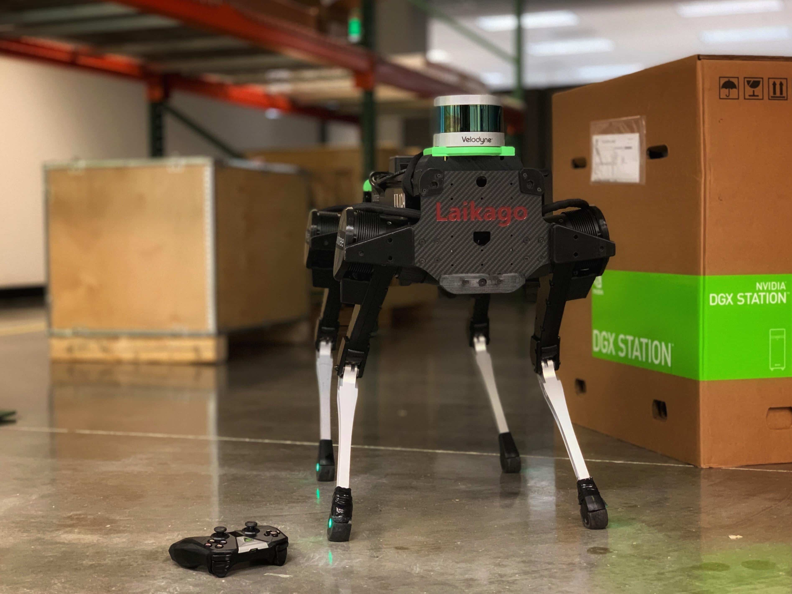
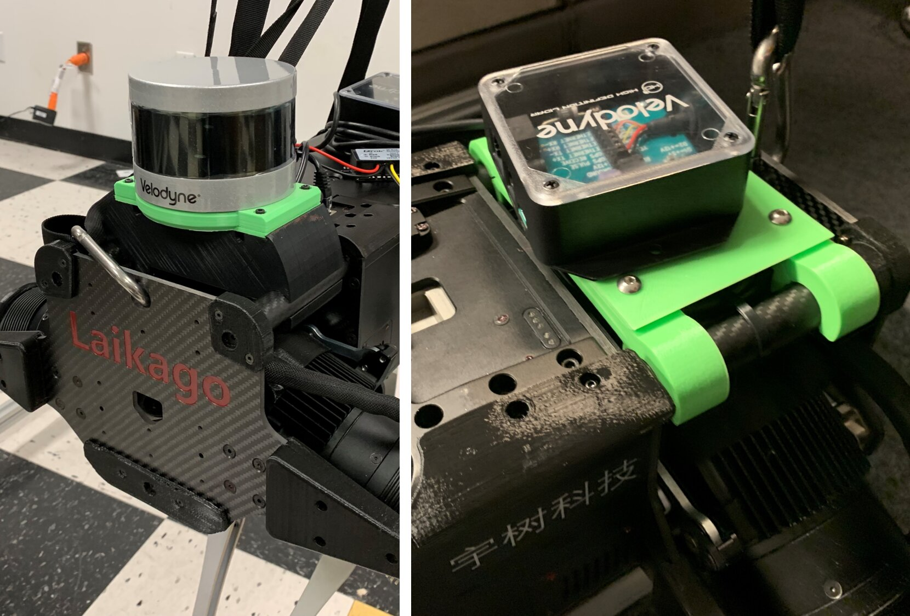

# laikago_lidar_mount
Laikago is a quadruped robot designed by [Unitree Robotics](http://www.unitree.cc/). This repository contains 3D-printable mesh files for Velodyne VLP-16 lidar mounting on the robot. With the lidar, the Laikago can be used as a fully autonomous machine with [Isaac SDK](https://developer.nvidia.com/isaac-sdk). For the complete project, see the [Isaac SDK document](https://docs.nvidia.com/isaac/isaac/doc/index.html)

